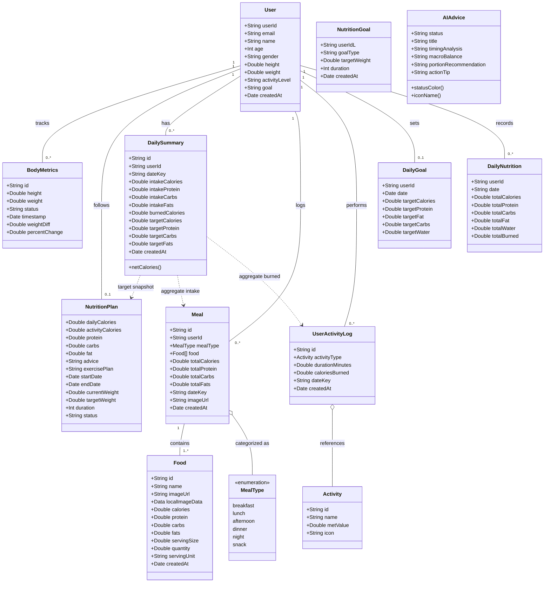

# Nutrix Class Diagram

```mermaid
classDiagram
    class User {
        +String userId
        +String email
        +String name
        +Int age
        +String gender
        +Double height
        +Double weight
        +String activityLevel
        +String goal
        +Date createdAt
    }

    class BodyMetrics {
        +String id
        +Double height
        +Double weight
        +String status
        +Date timestamp
        +Double weightDiff
        +Double percentChange
    }

    class NutritionPlan {
        +Double dailyCalories
        +Double activityCalories
        +Double protein
        +Double carbs
        +Double fat
        +String advice
        +String exercisePlan
        +Date startDate
        +Date endDate
        +Double currentWeight
        +Double targetWeight
        +Int duration
        +String status
    }

    class DailySummary {
        +String id
        +String userId
        +String dateKey
        +Double intakeCalories
        +Double intakeProtein
        +Double intakeCarbs
        +Double intakeFats
        +Double burnedCalories
        +Double targetCalories
        +Double targetProtein
        +Double targetCarbs
        +Double targetFats
        +Date createdAt
        +netCalories()
    }

    class Meal {
        +String id
        +String userId
        +MealType mealType
        +Food[] food
        +Double totalCalories
        +Double totalProtein
        +Double totalCarbs
        +Double totalFats
        +String dateKey
        +String imageUrl
        +Date createdAt
    }

    class Food {
        +String id
        +String name
        +String imageUrl
        +Data localImageData
        +Double calories
        +Double protein
        +Double carbs
        +Double fats
        +Double servingSize
        +Double quantity
        +String servingUnit
        +Date createdAt
    }

    class MealType {
        <<enumeration>>
        breakfast
        lunch
        afternoon
        dinner
        night
        snack
    }

    class Activity {
        +String id
        +String name
        +Double metValue
        +String icon
    }

    class UserActivityLog {
        +String id
        +Activity activityType
        +Double durationMinutes
        +Double caloriesBurned
        +String dateKey
        +Date createdAt
    }

    class DailyGoal {
        +String userId
        +Date date
        +Double targetCalories
        +Double targetProtein
        +Double targetFat
        +Double targetCarbs
        +Double targetWater
    }

    class DailyNutrition {
        +String userId
        +String date
        +Double totalCalories
        +Double totalProtein
        +Double totalCarbs
        +Double totalFat
        +Double totalWater
        +Double totalBurned
    }

    class NutritionGoal {
        +String userIdL
        +String goalType
        +Double targetWeight
        +Int duration
        +Date createdAt
    }

    class AIAdvice {
        +String status
        +String title
        +String timingAnalysis
        +String macroBalance
        +String portionRecommendation
        +String actionTip
        +statusColor()
        +iconName()
    }

    %% Relationships
    User "1" -- "0..*" BodyMetrics : tracks
    User "1" -- "0..1" NutritionPlan : follows
    User "1" -- "0..*" DailySummary : has
    User "1" -- "0..*" Meal : logs
    User "1" -- "0..*" UserActivityLog : performs
    User "1" -- "0..1" DailyGoal : sets
    User "1" -- "0..*" DailyNutrition : records

    Meal "1" -- "1..*" Food : contains
    Meal o-- MealType : categorized as
    
    UserActivityLog o-- Activity : references
    
    DailySummary ..> NutritionPlan : target snapshot
    DailySummary ..> Meal : aggregate intake
    DailySummary ..> UserActivityLog : aggregate burned
```
