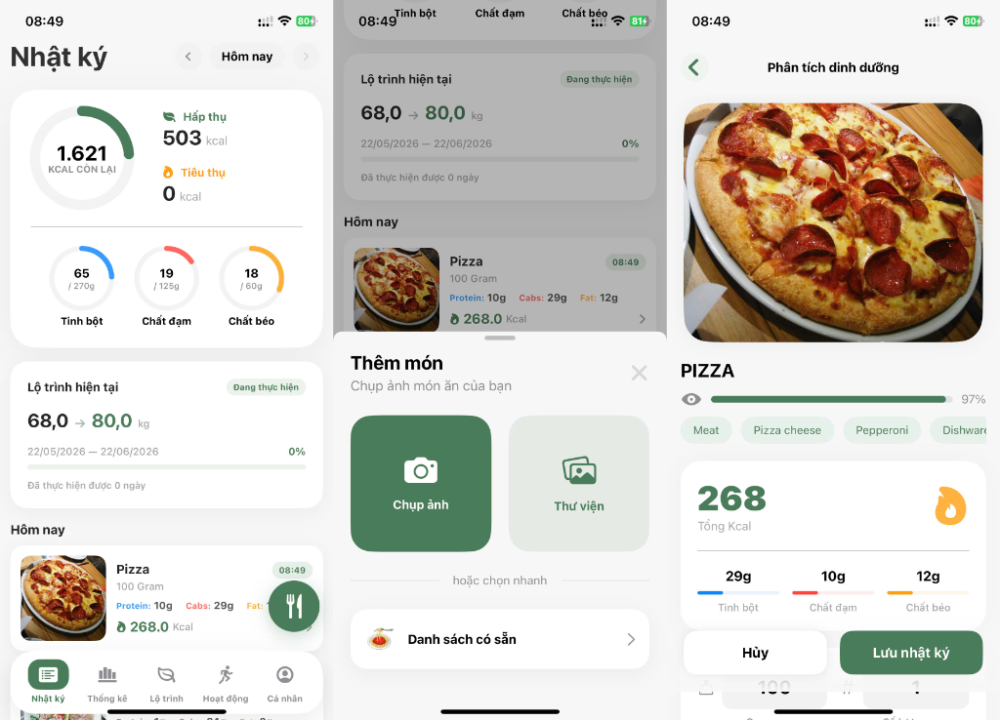
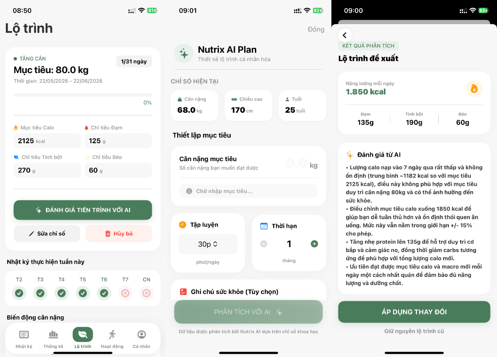
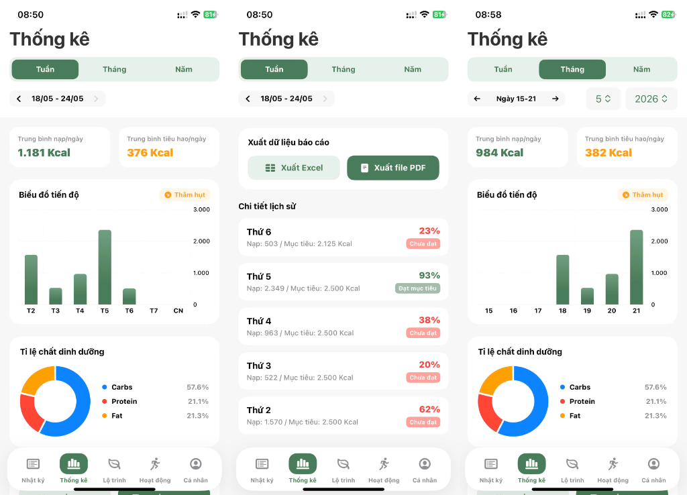

# Nutrix - AI Nutrition & Health Tracker

## Giới thiệu
**Nutrix** là ứng dụng di động theo dõi sức khỏe và dinh dưỡng tích hợp AI (Trí tuệ nhân tạo). Ứng dụng giúp người dùng dễ dàng theo dõi lượng calo nạp vào, tính toán các chỉ số dinh dưỡng cơ bản, thiết lập lộ trình sức khỏe cá nhân hóa thông qua AI, và ghi nhận nhật ký vận động hằng ngày.

## Các tính năng nổi bật

- **Quản lý dinh dưỡng thông minh**: Nhận diện và theo dõi chi tiết từng bữa ăn trong ngày (sáng, trưa, tối, ăn vặt). Tự động phân tích và tính toán chính xác tổng lượng calo, protein, carbs, và chất béo.
- **Lộ trình cá nhân hóa (AI Plan)**: Ứng dụng cung cấp các lộ trình mục tiêu sức khỏe dựa trên các phân tích chuyên sâu từ AI, giúp bạn tăng cân, giảm cân hoặc duy trì vóc dáng một cách khoa học.
- **Theo dõi nhật ký vận động**: Ghi lại các hoạt động thể thao hằng ngày, tự động tính toán lượng calo đốt cháy để cân bằng với lượng calo đã nạp vào.
- **Phân tích và Thống kê**: Cung cấp các biểu đồ trực quan giúp theo dõi tiến độ theo Ngày, Tuần, Tháng, và Năm. Hỗ trợ xuất báo cáo dữ liệu dưới dạng Excel/PDF.
- **Đồng bộ hóa Cloud Firestore**: Lưu trữ an toàn tất cả thông tin dinh dưỡng, lịch sử và hoạt động của người dùng theo thời gian thực.

## Hình ảnh giao diện (UI)

<p align="center">
  
  
  
</p>

## Kiến trúc Hệ thống

Nutrix áp dụng chặt chẽ kiến trúc **MVVM (Model - View - ViewModel)** kết hợp với Service layer nhằm đảm bảo mã nguồn dễ bảo trì và mở rộng.

- **Views (SwiftUI)**: Giao diện người dùng thuần SwiftUI. Tách biệt hoàn toàn khỏi logic nghiệp vụ, sử dụng view builder và animation mượt mà.
- **ViewModels**: Sử dụng Combine và `@Published` để quản lý luồng dữ liệu (state) và xử lý các business logic.
- **Services**: Triển khai theo Singleton pattern. Chịu trách nhiệm tương tác với API bên ngoài (Google Gemini, Edamam, Google Vision) và thao tác dữ liệu qua Firebase Firestore.
- **Models**: Định nghĩa các thực thể domain với `Codable` để mapping dữ liệu trực tiếp với Firebase/API.

## Cấu trúc Cơ sở dữ liệu (Firestore)

Ứng dụng quản lý dữ liệu với cấu trúc phân cấp, đảm bảo hiệu năng và dễ dàng trích xuất:
- `users`: Quản lý thông tin tài khoản người dùng và chỉ số cơ thể.
- `daily_summaries`: Thống kê tổng hợp lượng calo nạp vào/tiêu hao hàng ngày.
- `meals`: Ghi chú chi tiết các bữa ăn và các món ăn đã tiêu thụ.
- `plans` & `history_plans`: Lộ trình AI hiện hành và lịch sử các lộ trình của người dùng.
- `userActivities`: Nhật ký các bài tập và quá trình luyện tập thể thao.
- `activities` & `foods`: Dữ liệu master về các môn thể thao và thông tin dinh dưỡng món ăn từ Admin.

## Công nghệ sử dụng
- **Nền tảng**: iOS
- **Ngôn ngữ**: Swift
- **Framework UI**: SwiftUI
- **Kiến trúc**: MVVM, Combine
- **Backend/Database**: Firebase (Authentication, Cloud Firestore, Storage)
- **Tích hợp API AI**: Google Gemini API, Edamam API, Google Vision

## Hướng dẫn cài đặt

1. **Clone repository**:
   ```bash
   git clone <URL_CUA_REPO>
   cd Nutrix
   ```
2. **Mở dự án**:
   Mở file `Nutrix.xcodeproj` bằng Xcode.
3. **Cấu hình Firebase**:
   Đảm bảo file `GoogleService-Info.plist` đã được thêm vào thư mục `Nutrix` trong dự án Xcode.
4. **Cài đặt Dependencies**:
   Dự án sử dụng Swift Package Manager (SPM). Xcode sẽ tự động tải các package phụ thuộc khi bạn mở dự án. Hãy chờ Xcode "Resolve Package Dependencies" xong.
5. **Biên dịch và Chạy**:
   Chọn thiết bị mô phỏng (Simulator) hoặc thiết bị thật (iPhone iOS 16.0 trở lên) và nhấn `Cmd + R` để chạy ứng dụng.
